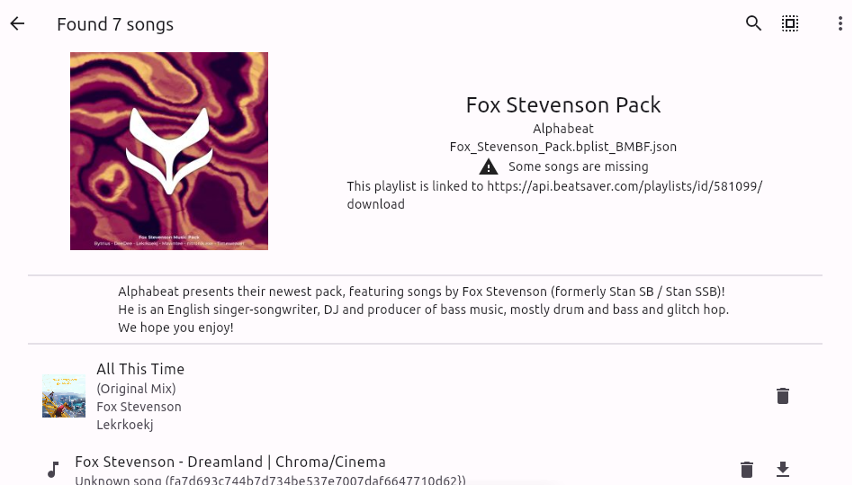

# Quest Song Manager

This is a simple song maanger for the Quest version of Beat Saber.

## Features

- Manage songs and playlists
- WebView to download songs from sources that support the `beatsaver://` protocol, examples are
	- https://bsaber.com/
	- https://beatsaver.com/
- Download songs directly to playlists
- Add your own sources to the browser bookmarks
- Super fast startup thanks to caching of the song hashes
- Open source :)

## Getting Started

1) Download the APK and install it on your Quest
2) Start the app, allow file access and let it scan your songs
3) Enjoy!

## Details

The app will scan the beat saber `ModData` folder in the quest internal storage. It can load and save `json` playlists in a way that is compatible with BMBF.

Additionally, the app caches the song hashes to files called `.bsq_hash_cache` in each song folder. These files can be safely deleted and this feature can be disabled in the settings, but it will make the app start much slower.

## Screenshots

Main screen

Download manager

Playlist editor

## Development

The app is written using the flutter framework. To build it, you need to have flutter installed and a working android development environment.

Testing on the quest is rather annoying, for development purposes the app also run on Windows and Linux with most features working, you need to change the hardcoded path in `lib/main.dart` to a folder that has the same file structure as the quest internal storage. The webview feature is only available on Android though, for testing that you can run the app on an emulator or a simple android phone.